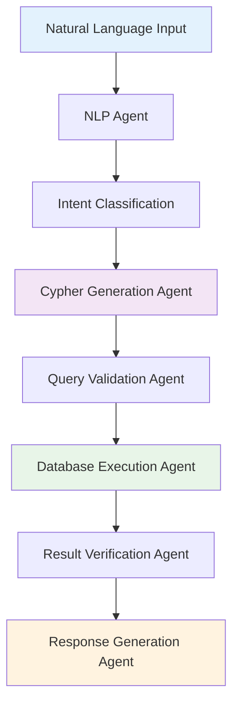
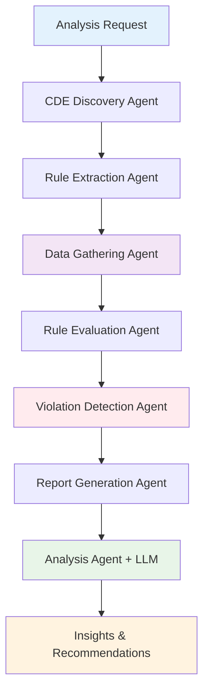
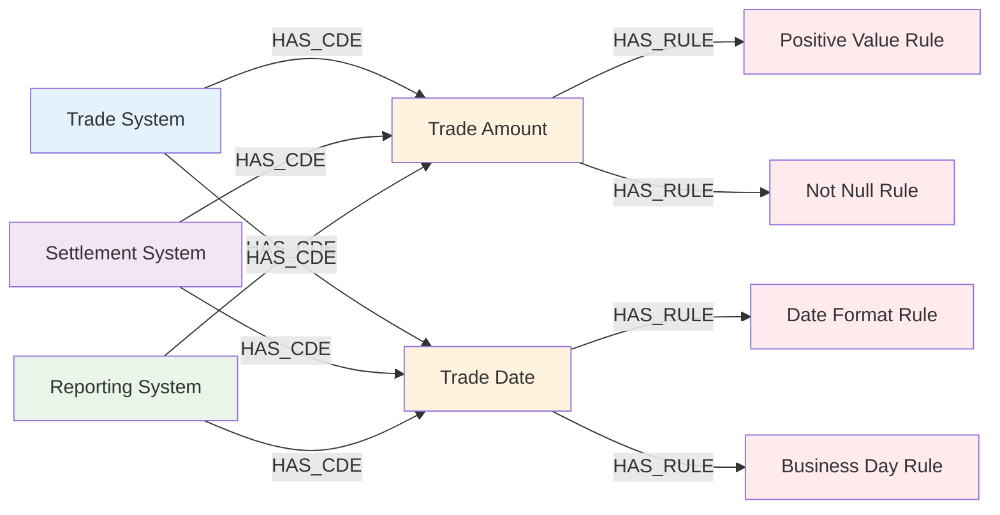

# Investment Banking Data Quality Management System
*An Agentic AI-Powered Solution for Cross-System Data Lineage Validation*

## 📋 Table of Contents
- [Business Problem](#business-problem)
- [Solution Architecture](#solution-architecture)
- [Applications](#applications)
- [How to Run](#how-to-run)
- [Agentic Workflows](#agentic-workflows)
- [Graph Database Schema](#graph-database-schema)
- [Relational Database Schemas](#relational-database-schemas)
- [Known Issues](#known-issues)
- [Future Development](#future-development)
- [Technology Introductions](#technology-introductions)

## 🏦 Business Problem

Investment banks face critical challenges in maintaining data quality across complex trading ecosystems. The problem spans multiple systems in the trade lifecycle:

### Data Lineage Challenge
- **Front Office**: Trading systems generate trade data with specific business rules
- **Middle Office**: Settlement systems process and validate trade data
- **Back Office**: Regulatory reporting systems require accurate, compliant data
- **Critical Data Elements (CDEs)**: Key data points that must maintain integrity across all systems

### Current Pain Points
1. **Data Inconsistency**: Same trade data appears differently across systems
2. **Manual Validation**: Time-consuming manual checks for data quality violations
3. **Regulatory Risk**: Inconsistent data leads to compliance failures
4. **Operational Risk**: Poor data quality impacts trading decisions and settlements
5. **Scalability**: Traditional rule-based systems don't scale with growing data volumes

### Our Solution
We leverage **Graph Databases** to model Critical Data Elements (CDEs) and Data Quality (DQ) Rules, creating a unified view of data lineage and quality requirements across the entire trading ecosystem. Our agentic AI system automatically validates data quality rules across all systems and generates comprehensive violation reports.

## 🏗️ Solution Architecture

```
┌─────────────────┐    ┌──────────────────┐    ┌─────────────────┐
│   Front Office  │    │  Middle Office   │    │  Back Office    │
│ Trading System  │    │Settlement System │    │Reporting System │
│    (MySQL)      │    │     (MySQL)      │    │    (MySQL)      │
└─────────┬───────┘    └────────┬─────────┘    └─────────┬───────┘
          │                     │                        │
          └─────────────────────┼────────────────────────┘
                                │
                    ┌───────────▼──────────┐
                    │      Trino Engine    │
                    │ (Distributed Query)  │
                    └───────────┬──────────┘
                                │
                    ┌───────────▼──────────┐
                    │    Agentic AI Layer  │
                    │     (LangGraph)      │
                    └───────────┬──────────┘
                                │
                    ┌───────────▼──────────┐
                    │   Neo4j Graph DB     │
                    │ (CDEs & DQ Rules)    │
                    └──────────────────────┘
```

## 🔧 Applications

### Application 1: Graph Database Management Tool
**Purpose**: Modify Neo4j graph database CDEs and DQ Rules using natural language

**Features**:
- Plain English input for rule modifications
- Automatic Cypher query generation
- Neo4j database updates
- Rule validation and testing

**Agentic Components**:
- Natural Language Processing Agent
- Cypher Generation Agent
- Database Validation Agent
- Error Handling Agent

### Application 2: Data Quality Validation Engine
**Purpose**: Apply DQ Rules across all systems and generate violation reports

**Features**:
- Cross-system data quality validation
- Automated violation detection
- Comprehensive reporting
- Real-time monitoring capabilities

**Agentic Components**:
- Data Extraction Agent
- Rule Evaluation Agent
- Report Generation Agent
- Analysis and Insights Agent

## 🚀 How to Run

### Prerequisites
```bash
# Install dependencies
pip install -r requirements.txt

# Set up environment variables
cp .env.example .env
# Edit .env with your database credentials
```

### Application 1: Graph Database Management
```bash
# Start the graph database management tool
python graph_db_manager.py

# Example usage:
# "Add a new DQ rule for trade amounts to be positive"
# "Modify the settlement date CDE to include weekends"
```

### Application 2: Data Quality Validation
```bash
# Run quick validation test
python quick_start.py

# Run full workflow with reporting
python sample_dq_workflow.py

# Monitor specific trade IDs
python monitor_trades.py --uitids T001,T002,T003
```

### Docker Setup
```bash
# Start all services
docker-compose up -d

# Verify Trino connection
curl http://localhost:8080/v1/info
```

## 🤖 Agentic Workflows

### Application 1: Graph Database Management Workflow



**LangGraph Workflow**:
- **Database Management Workflow**
  - **NLP Agent Node**: Processes natural language input
  - **Cypher Agent Node**: Generates Neo4j Cypher queries
  - **Validation Agent Node**: Validates query syntax and logic
  - **Execution Agent Node**: Executes queries against Neo4j
  - **Verification Agent Node**: Confirms changes were applied correctly

**State & Tools**:
- **State Flow**: Parse input → generate Cypher → validate syntax → execute query → verify results
- **Tools**: Neo4j Driver, Cypher Parser, Query Validator, Natural Language Processor

### Application 2: Data Quality Validation Workflow



**LangGraph Workflow**:
- **Data Quality Analysis Workflow**
  - **Discovery Agent Node**: Finds CDEs and rules in Neo4j
  - **Extraction Agent Node**: Pulls data from multiple MySQL systems via Trino
  - **Evaluation Agent Node**: Applies DQ rules across all systems
  - **Detection Agent Node**: Identifies violations and inconsistencies
  - **Reporting Agent Node**: Generates structured violation reports
  - **Analysis Agent Node**: Provides AI-powered insights and recommendations

**State & Tools**:
- **State Flow**: Extract metadata → gather data → evaluate rules → detect violations → generate reports → analyze patterns
- **Tools**: Neo4j Driver, Trino Connector, Rule Engine, Report Generator, LLM Integration

## 📊 Graph Database Schema

### Neo4j Graph Structure



### Node Types & Relationships

**Node Types**:
- **System**: Represents trading systems (Trade, Settlement, Reporting)
- **CDE**: Critical Data Elements that must maintain quality
- **DQRule**: Data Quality Rules that validate CDEs

**Relationships**:
- **HAS_CDE**: System contains a Critical Data Element
- **HAS_RULE**: CDE is validated by a Data Quality Rule
- **APPLIES_TO**: Rule applies to specific systems

**Properties**:
- **System**: `name`, `type`, `description`, `connection_info`
- **CDE**: `name`, `data_type`, `description`, `table_name`, `column_name`
- **DQRule**: `rule_id`, `rule_type`, `description`, `severity`, `is_active`

## 🗄️ Relational Database Schemas

### Trading System Database (MySQL)

```sql
-- Trade System Schema
CREATE TABLE trades (
    uitid VARCHAR(50) PRIMARY KEY,
    trade_date DATE NOT NULL,
    symbol VARCHAR(20) NOT NULL,
    quantity DECIMAL(15,2) NOT NULL,
    price DECIMAL(15,4) NOT NULL,
    side ENUM('BUY', 'SELL') NOT NULL,
    trader_id VARCHAR(20),
    created_at TIMESTAMP DEFAULT CURRENT_TIMESTAMP
);

CREATE TABLE positions (
    position_id VARCHAR(50) PRIMARY KEY,
    uitid VARCHAR(50),
    symbol VARCHAR(20),
    quantity DECIMAL(15,2),
    average_price DECIMAL(15,4),
    FOREIGN KEY (uitid) REFERENCES trades(uitid)
);
```

### Settlement System Database (MySQL)

```sql
-- Settlement System Schema
CREATE TABLE settlements (
    settlement_id VARCHAR(50) PRIMARY KEY,
    uitid VARCHAR(50) NOT NULL,
    settlement_date DATE,
    settlement_amount DECIMAL(15,2),
    settlement_status ENUM('PENDING', 'SETTLED', 'FAILED'),
    counterparty VARCHAR(100),
    created_at TIMESTAMP DEFAULT CURRENT_TIMESTAMP
);

CREATE TABLE settlement_instructions (
    instruction_id VARCHAR(50) PRIMARY KEY,
    settlement_id VARCHAR(50),
    instruction_type VARCHAR(50),
    instruction_details TEXT,
    FOREIGN KEY (settlement_id) REFERENCES settlements(settlement_id)
);
```

### Reporting System Database (MySQL)

```sql
-- Reporting System Schema
CREATE TABLE regulatory_reports (
    report_id VARCHAR(50) PRIMARY KEY,
    uitid VARCHAR(50) NOT NULL,
    report_date DATE NOT NULL,
    report_type VARCHAR(50),
    regulatory_body VARCHAR(100),
    report_data JSON,
    submission_status ENUM('DRAFT', 'SUBMITTED', 'APPROVED', 'REJECTED'),
    created_at TIMESTAMP DEFAULT CURRENT_TIMESTAMP
);

CREATE TABLE compliance_checks (
    check_id VARCHAR(50) PRIMARY KEY,
    uitid VARCHAR(50),
    check_type VARCHAR(50),
    check_result ENUM('PASS', 'FAIL', 'WARNING'),
    check_details TEXT,
    FOREIGN KEY (uitid) REFERENCES regulatory_reports(uitid)
);
```

## ⚠️ Known Issues

### Current Limitations
1. **Trino Configuration**: JVM settings may need adjustment for large datasets
2. **Network Connectivity**: Docker networking issues on Windows with `host.docker.internal`
3. **Neo4j Schema**: Manual schema initialization required for first-time setup
4. **Memory Usage**: LangGraph workflows can consume significant memory with large datasets
5. **Error Handling**: Some edge cases in rule evaluation need better error recovery

### Workarounds
- Use specific JVM configurations in `trino-config/jvm.config`
- Ensure proper network settings in `docker-compose.yml`
- Run `quick_start.py` to verify all connections before full workflow
- Monitor system resources during large-scale analyses

## 🔮 Future Development

### Planned Features

#### User Interface
- **Web Dashboard**: React-based UI for rule management and reporting
- **Interactive Visualizations**: D3.js graphs for data lineage visualization
- **Real-time Monitoring**: Live dashboard for violation tracking
- **Mobile Interface**: Mobile-responsive design for on-the-go monitoring

#### Enhanced AI Capabilities
- **Predictive Analytics**: ML models to predict potential data quality issues
- **Automated Rule Generation**: AI-suggested rules based on data patterns
- **Natural Language Querying**: Conversational interface for data exploration
- **Intelligent Alerting**: Context-aware notifications for critical violations

#### Integration Enhancements
- **REST API**: Full API for external system integration
- **Kafka Integration**: Real-time data streaming for immediate validation
- **Cloud Deployment**: AWS/Azure deployment templates
- **Multi-tenant Support**: Support for multiple business units

## 🎓 Technology Introductions

### Agentic AI
Agentic AI represents a paradigm shift from traditional rule-based systems to intelligent, autonomous agents that can:
- **Reason**: Make decisions based on complex data relationships
- **Act**: Take actions without human intervention
- **Adapt**: Learn from new data patterns and scenarios
- **Collaborate**: Work together in multi-agent systems
- **Communicate**: Provide natural language explanations for decisions

**In Our System**: Agents handle data discovery, rule evaluation, and report generation autonomously.

### LangGraph
LangGraph is a framework for building stateful, multi-actor applications with Large Language Models (LLMs):
- **State Management**: Maintains context across agent interactions
- **Workflow Orchestration**: Defines complex multi-step processes
- **Agent Coordination**: Enables agents to work together seamlessly
- **Error Handling**: Built-in error recovery and retry mechanisms

**Our Implementation**: We use LangGraph to orchestrate data quality workflows with multiple specialized agents.

### Graph Databases
Graph databases excel at representing complex relationships:
- **Nodes**: Entities like Systems, CDEs, and Rules
- **Relationships**: Connections that define data lineage
- **Properties**: Attributes that describe entities
- **Cypher**: Query language for graph traversal

**Benefits for Data Quality**: Perfect for modeling data lineage and rule dependencies across systems.

### Docker
Docker containerization provides:
- **Isolation**: Each service runs in its own container
- **Portability**: Consistent deployment across environments
- **Scalability**: Easy horizontal scaling of services
- **Dependency Management**: Eliminates "works on my machine" issues

**Our Setup**: Containerized Trino, Neo4j, and MySQL for easy deployment.

### Trino
Trino is a distributed SQL query engine designed for:
- **Multi-source Queries**: Query across different databases simultaneously
- **High Performance**: Optimized for analytical workloads
- **Scalability**: Horizontal scaling across multiple nodes
- **Connector Architecture**: Supports various data sources

**Our Use Case**: Enables cross-system data quality validation with single queries.

### Other Frameworks Used

#### Python Ecosystem
- **Pandas**: Data manipulation and analysis
- **Pydantic**: Data validation and serialization
- **FastAPI**: API development (planned)
- **Streamlit**: Rapid prototyping of UI components

#### Database Connectors
- **Neo4j Python Driver**: Graph database connectivity
- **Trino Python Client**: Distributed query execution
- **PyMySQL**: MySQL database connectivity

#### AI/ML Libraries
- **LangChain**: LLM integration and chaining
- **OpenAI**: GPT model integration
- **Transformers**: Custom model deployment

### Vibe Coding
Vibe Coding is a development philosophy emphasizing:
- **Flow State**: Maintaining continuous development momentum
- **Contextual Awareness**: Understanding the bigger picture
- **Iterative Refinement**: Continuous improvement through feedback
- **Collaborative Intelligence**: Human-AI partnership in development

**Application**: Our development process leverages AI tools while maintaining human oversight and creativity.

### Cursor
Cursor is an AI-powered code editor that revolutionizes development:
- **Context Awareness**: Understands entire codebase context
- **Intelligent Suggestions**: Provides relevant code completions
- **Multi-file Editing**: Simultaneous edits across multiple files
- **Natural Language Commands**: Code generation from descriptions

**Our Experience**: Cursor significantly accelerated development of complex agent workflows.

### Cursor vs Other AI Code Generation Tools

| Feature | Cursor | GitHub Copilot | ChatGPT | Replit Ghostwriter |
|---------|--------|----------------|---------|-------------------|
| **Context Awareness** | ✅ Full codebase | ⚠️ Limited | ❌ No context | ⚠️ Limited |
| **Multi-file Editing** | ✅ Yes | ❌ No | ❌ No | ❌ No |
| **IDE Integration** | ✅ Native | ✅ Good | ❌ External | ✅ Native |
| **Code Understanding** | ✅ Excellent | ✅ Good | ⚠️ Limited | ⚠️ Limited |
| **Refactoring Support** | ✅ Advanced | ⚠️ Basic | ❌ Manual | ⚠️ Basic |
| **Natural Language** | ✅ Advanced | ⚠️ Basic | ✅ Excellent | ⚠️ Basic |

**Why We Choose Cursor**:
1. **Codebase Awareness**: Understands our entire multi-agent architecture
2. **Intelligent Refactoring**: Helps maintain code quality across complex workflows
3. **Context Preservation**: Maintains understanding of our domain-specific requirements
4. **Rapid Prototyping**: Enables quick iteration on agent behaviors and workflows

---

*This system represents the convergence of modern AI, graph databases, and distributed computing to solve critical data quality challenges in investment banking.*