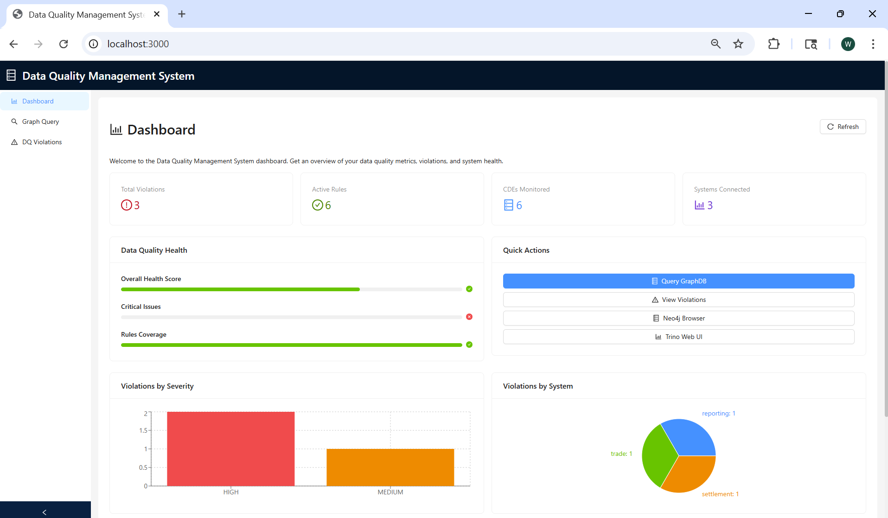
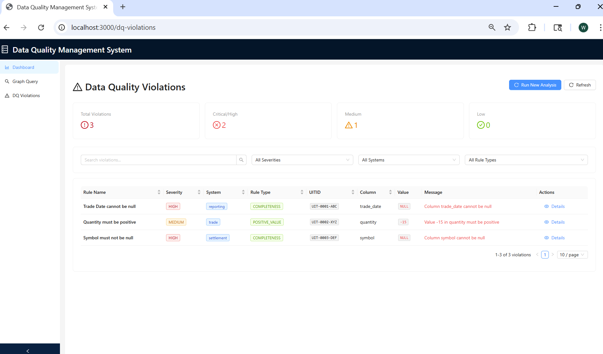
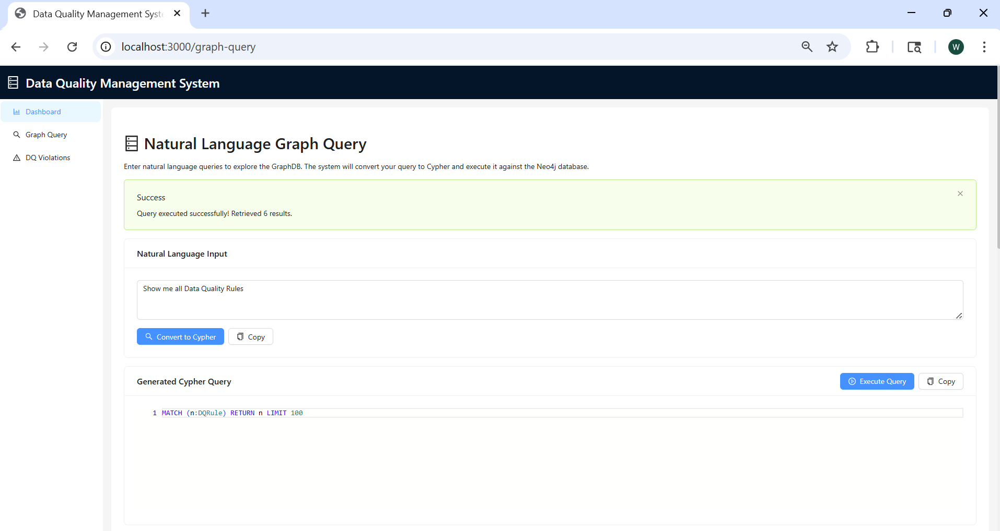
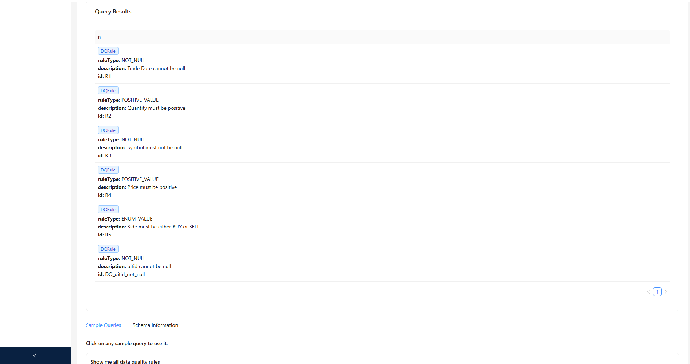
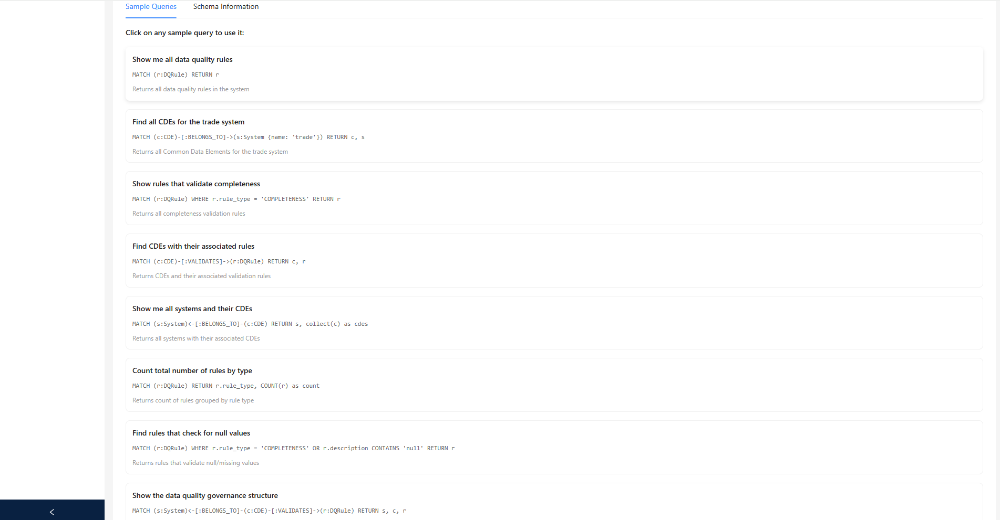
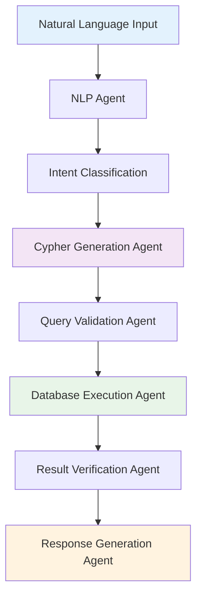
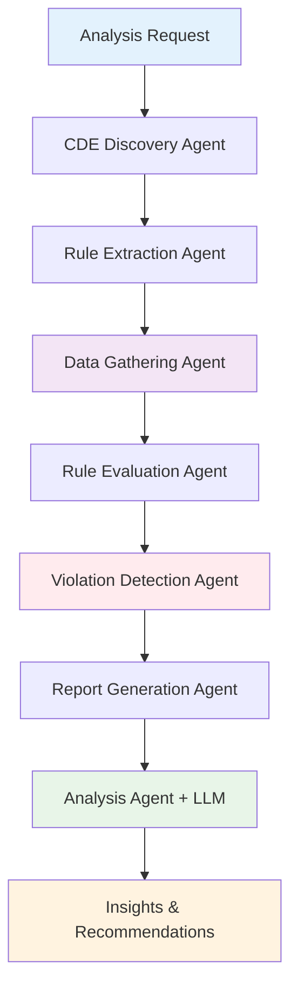
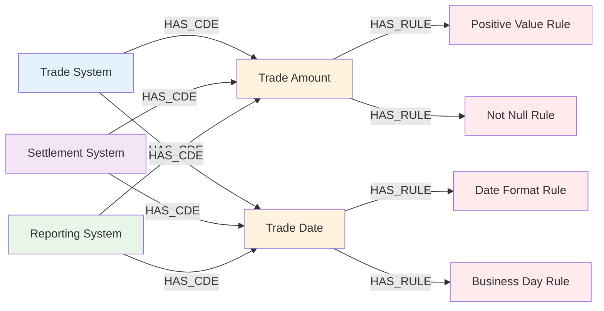

# Investment Banking Data Quality Management System
*An Agentic AI-Powered Solution for Cross-System Data Lineage Validation*

## 📋 Table of Contents
- [Business Problem](#business-problem)
- [Solution Architecture](#solution-architecture)
- [Applications](#applications)
- [How to Run](#how-to-run)
- [Agentic Workflows](#agentic-workflows)
- [Graph Database Schema](#graph-database-schema)
- [Relational Database Schemas](#relational-database-schemas)
- [Known Issues](#known-issues)
- [Future Development](#future-development)
- [Technology Introductions](#technology-introductions)

## 🏦 Business Problem

Investment banks face critical challenges in maintaining data quality across complex trading ecosystems. The problem spans multiple systems in the trade lifecycle:

### Data Lineage Challenge
- **Front Office**: Trading systems generate trade data with specific business rules
- **Middle Office**: Settlement systems process and validate trade data
- **Back Office**: Regulatory reporting systems require accurate, compliant data
- **Critical Data Elements (CDEs)**: Key data points that must maintain integrity across all systems

### Current Pain Points
1. **Data Inconsistency**: Same trade data appears differently across systems
2. **Manual Validation**: Time-consuming manual checks for data quality violations
3. **Regulatory Risk**: Inconsistent data leads to compliance failures
4. **Operational Risk**: Poor data quality impacts trading decisions and settlements
5. **Scalability**: Traditional rule-based systems don't scale with growing data volumes

### Our Solution
We leverage **Graph Databases** to model Critical Data Elements (CDEs) and Data Quality (DQ) Rules, creating a unified view of data lineage and quality requirements across the entire trading ecosystem. Our agentic AI system automatically validates data quality rules across all systems and generates comprehensive violation reports.

## 🏗️ Solution Architecture

```
┌─────────────────┐    ┌──────────────────┐    ┌─────────────────┐
│   Front Office  │    │  Middle Office   │    │  Back Office    │
│ Trading System  │    │Settlement System │    │Reporting System │
│    (MySQL)      │    │     (MySQL)      │    │    (MySQL)      │
└─────────┬───────┘    └────────┬─────────┘    └─────────┬───────┘
          │                     │                        │
          └─────────────────────┼────────────────────────┘
                                │
                    ┌───────────▼──────────┐
                    │      Trino Engine    │
                    │ (Distributed Query)  │
                    └───────────┬──────────┘
                                │
                    ┌───────────▼──────────┐
                    │    Agentic AI Layer  │
                    │     (LangGraph)      │
                    └───────────┬──────────┘
                                │
                    ┌───────────▼──────────┐
                    │   Neo4j Graph DB     │
                    │ (CDEs & DQ Rules)    │
                    └──────────────────────┘
```

## 🔧 Applications

### Application 1: React Web UI Dashboard
**Purpose**: Interactive web interface for data quality management and monitoring

**Features**:
- **Dashboard**: Real-time data quality metrics and violation summaries
- **Violations Management**: Browse, filter, and analyze DQ violations
- **Graph Query Interface**: Natural language to Cypher query conversion
- **Rule Management**: View and manage data quality rules
- **System Monitoring**: Track data quality across all trading systems
- **Responsive Design**: Mobile-friendly interface

**Tech Stack**:
- React 18 with TypeScript
- Ant Design UI components
- Axios for API communication
- Modern responsive layout

**Access**: http://localhost:3000

### Application 2: Graph Database Management Tool
**Purpose**: Modify Neo4j graph database CDEs and DQ Rules using natural language

**Features**:
- Plain English input for rule modifications
- Automatic Cypher query generation
- Neo4j database updates
- Rule validation and testing
- Interactive query interface

**Agentic Components**:
- Natural Language Processing Agent
- Cypher Generation Agent
- Database Validation Agent
- Error Handling Agent

**Access**: Via REST API at http://localhost:8000/api/graphdb/

### Application 3: Data Quality Validation Engine
**Purpose**: Apply DQ Rules across all systems and generate violation reports

**Features**:
- Cross-system data quality validation
- Automated violation detection
- Comprehensive reporting
- Real-time monitoring capabilities
- Optional CSV export
- Batch processing support

**Agentic Components**:
- Data Extraction Agent
- Rule Evaluation Agent
- Report Generation Agent
- Analysis and Insights Agent

**Access**: Via REST API at http://localhost:8000/api/dq/

## 🖥️ Web UI Features

### Dashboard Overview
The React-based web interface provides a comprehensive view of your data quality management system. Below are screenshots showing the key features and interface elements:

#### 📊 Main Dashboard
- **Real-time Metrics**: Live violation counts and system health indicators
- **Severity Breakdown**: Critical, High, Medium, and Low severity violation counts
- **System Overview**: Data quality status across Trade, Settlement, and Reporting systems
- **Quick Actions**: One-click access to run new analysis or refresh data


*Main dashboard showing real-time data quality metrics and system overview*

#### 🔍 Data Quality Violations Page
- **Comprehensive Table**: View all violations with sortable columns
- **Advanced Filtering**: Filter by severity, system, rule type, or search text
- **Violation Details**: Modal popup with complete violation information
- **Batch Operations**: Run new analysis or export violations
- **Auto-refresh**: Real-time updates as new violations are detected


*Data Quality Violations page with comprehensive filtering and violation details*

#### 📈 Graph Query Interface
- **Natural Language Input**: Convert plain English to Cypher queries
- **Sample Queries**: Pre-built queries for common data exploration tasks
- **Interactive Results**: Formatted display of query results
- **Query History**: Track your previous queries and results
- **Schema Explorer**: Browse available nodes, relationships, and properties


*Natural language query input and sample queries section*


*Query execution and results display*


*Complete query results with formatted output*

#### 🔧 System Administration
- **Rule Management**: View and understand active data quality rules
- **System Health**: Monitor connectivity to Neo4j, Trino, and MySQL
- **API Documentation**: Built-in access to FastAPI documentation
- **Performance Metrics**: Track query execution times and system performance

### Usage Examples

#### Running Data Quality Analysis
1. Navigate to the **Dashboard** tab (see screenshot above)
2. Click **"Run New Analysis"** button
3. View real-time results as violations are detected
4. Navigate to **Violations** tab for detailed analysis (see DQ Violations screenshot above)

#### Exploring Graph Database
1. Go to **Graph Query** tab (see Graph Query screenshots above)
2. Enter natural language query: *"Show me all rules for trade amounts"*
3. Review generated Cypher query
4. Execute and view results
5. Use sample queries for common explorations

#### Managing Violations
1. Open **Violations** tab (see DQ Violations screenshot above)
2. Use filters to narrow down specific issues
3. Click **"Details"** on any violation for complete information
4. Export to CSV for external analysis if needed

## 🚀 How to Run

### Prerequisites

#### Software Requirements
- **Python 3.8+** with pip
- **Node.js 16+** with npm
- **Neo4j 4.0+** (running locally)
- **MySQL 8.0+** (running locally)
- **Docker** (for Trino service)

#### Database Setup
```bash
# 1. Install and start Neo4j locally
# Download from: https://neo4j.com/download/
# Default connection: bolt://localhost:7687
# Web interface: http://localhost:7474/browser/

# 2. Install and start MySQL locally
# Create required databases:
# - trade_system
# - settlement_system  
# - reporting_system

# 3. Install Python dependencies
pip install -r requirements.txt

# 4. Set up environment variables
cp .env.example .env
# Edit .env with your database credentials

# 5. Install Node.js dependencies for the UI
cd frontend
npm install
cd ..
```

### Complete System Setup (All Applications)

#### 1. Start Infrastructure Services
```bash
# Start Trino service in Docker
docker-compose up -d

# Verify Trino connection
curl http://localhost:8080/v1/info

# Ensure Neo4j is running locally (not in Docker)
# Default: bolt://localhost:7687
# Web interface: http://localhost:7474/browser/

# Ensure MySQL is running locally (not in Docker)
# Default: localhost:3306
# Multiple databases: trade_system, settlement_system, reporting_system
```

#### 2. Start Backend API
```bash
# Start the FastAPI backend server
cd backend
python main.py

# Backend will be available at http://localhost:8000
# API documentation at http://localhost:8000/docs
```

#### 3. Start Frontend UI
```bash
# Start the React frontend (in a separate terminal)
cd frontend
npm start

# Frontend will be available at http://localhost:3000
```

#### 4. Launch Complete System (Automated)
```bash
# Use the automated startup script
python start_dq_system.py

# This script will:
# - Start Trino in Docker
# - Check Neo4j and MySQL connections (must be running locally)
# - Launch the backend API
# - Launch the React frontend
# - Open the UI in your browser
```

### Individual Application Testing

#### Application 1: Graph Database Management
```bash
# Test natural language to Cypher conversion
python -c "
from backend.services.cypher_service import CypherService
service = CypherService()
result = service.natural_language_to_cypher('Show me all DQ rules')
print(result)
"
```

#### Application 2: Data Quality Validation
```bash
# Run quick validation test
python quick_start.py

# Run full workflow with reporting
python sample_dq_workflow.py

# Monitor specific trade IDs
python -c "
from sample_dq_workflow import run_dq_analysis_workflow
result = run_dq_analysis_workflow(['T001', 'T002', 'T003'])
print(f'Found {len(result.get(\"violations\", []))} violations')
"
```

### Docker Setup (Trino Only)
```bash
# Start Trino service in Docker
docker-compose up -d

# Check Trino service status
docker-compose ps

# View Trino logs
docker-compose logs -f trino

# Note: Neo4j and MySQL must be running locally
# - Neo4j: bolt://localhost:7687
# - MySQL: localhost:3306 (with trade_system, settlement_system, reporting_system databases)
```

## 🔌 API Endpoints

### Graph Database Management
- **POST** `/api/graphdb/nl-to-cypher` - Convert natural language to Cypher
- **POST** `/api/graphdb/execute-cypher` - Execute Cypher queries
- **GET** `/api/graphdb/schema` - Get database schema information
- **GET** `/api/graphdb/sample-queries` - Get sample queries

### Data Quality Management
- **POST** `/api/dq/analyze` - Run data quality analysis
- **GET** `/api/dq/violations` - Get current violations
- **GET** `/api/dq/rules` - Get all DQ rules
- **GET** `/api/dq/cdes` - Get all CDEs
- **GET** `/api/dq/systems` - Get system information
- **POST** `/api/dq/export-csv` - Export violations to CSV (optional)

### System Health
- **GET** `/health` - API health check
- **GET** `/docs` - Interactive API documentation
- **GET** `/redoc` - Alternative API documentation

### Example API Usage
```bash
# Run data quality analysis
curl -X POST "http://localhost:8000/api/dq/analyze" \
  -H "Content-Type: application/json" \
  -d '{"uitids": ["T001", "T002"]}'

# Get violations
curl "http://localhost:8000/api/dq/violations"

# Convert natural language to Cypher
curl -X POST "http://localhost:8000/api/graphdb/nl-to-cypher" \
  -H "Content-Type: application/json" \
  -d '{"query": "Show me all DQ rules for trade amounts"}'

# Export violations to CSV (optional)
curl -X POST "http://localhost:8000/api/dq/export-csv"
```

## 🤖 Agentic Workflows

### Application 1: Graph Database Management Workflow



**LangGraph Workflow**:
- **Database Management Workflow**
  - **NLP Agent Node**: Processes natural language input
  - **Cypher Agent Node**: Generates Neo4j Cypher queries
  - **Validation Agent Node**: Validates query syntax and logic
  - **Execution Agent Node**: Executes queries against Neo4j
  - **Verification Agent Node**: Confirms changes were applied correctly

**State & Tools**:
- **State Flow**: Parse input → generate Cypher → validate syntax → execute query → verify results
- **Tools**: Neo4j Driver, Cypher Parser, Query Validator, Natural Language Processor

### Application 2: Data Quality Validation Workflow



**LangGraph Workflow**:
- **Data Quality Analysis Workflow**
  - **Discovery Agent Node**: Finds CDEs and rules in Neo4j
  - **Extraction Agent Node**: Pulls data from multiple MySQL systems via Trino
  - **Evaluation Agent Node**: Applies DQ rules across all systems
  - **Detection Agent Node**: Identifies violations and inconsistencies
  - **Reporting Agent Node**: Generates structured violation reports
  - **Analysis Agent Node**: Provides AI-powered insights and recommendations

**State & Tools**:
- **State Flow**: Extract metadata → gather data → evaluate rules → detect violations → generate reports → analyze patterns
- **Tools**: Neo4j Driver, Trino Connector, Rule Engine, Report Generator, LLM Integration

## 📊 Graph Database Schema

### Neo4j Graph Structure



### Node Types & Relationships

**Node Types**:
- **System**: Represents trading systems (Trade, Settlement, Reporting)
- **CDE**: Critical Data Elements that must maintain quality
- **DQRule**: Data Quality Rules that validate CDEs

**Relationships**:
- **HAS_CDE**: System contains a Critical Data Element
- **HAS_RULE**: CDE is validated by a Data Quality Rule
- **APPLIES_TO**: Rule applies to specific systems

**Properties**:
- **System**: `name`, `type`, `description`, `connection_info`
- **CDE**: `name`, `data_type`, `description`, `table_name`, `column_name`
- **DQRule**: `rule_id`, `rule_type`, `description`, `severity`, `is_active`

## 🗄️ Relational Database Schemas

### Trading System Database (MySQL)

```sql
-- Trade System Schema
CREATE TABLE trade (
    trade_id INTEGER PRIMARY KEY,
    trader_id VARCHAR(32),
    symbol VARCHAR(20),
    cusip VARCHAR(15),
    side VARCHAR(4),
    trade_date DATE,
    settle_date DATE,
    quantity INTEGER,
    price DECIMAL(15,4),
    net_amount DECIMAL(18,2),
    trade_currency CHAR(3),
    settlement_currency CHAR(3),
    book_name VARCHAR(10),
    uitid VARCHAR(64)
);
```

### Settlement System Database (MySQL)

```sql
-- Settlement System Schema
CREATE TABLE trade (
    trade_id BIGINT PRIMARY KEY,
    counterparty_name VARCHAR(100),
    symbol VARCHAR(10),
    cusip VARCHAR(15),
    trade_date DATE,
    settlement_date DATE,
    side VARCHAR(4),
    quantity INTEGER,
    price DECIMAL(18,6),
    net_amount DECIMAL(18,2),
    trade_currency CHAR(3),
    settlement_currency CHAR(3),
    book_name VARCHAR(10),
    settlement_status VARCHAR(11),
    source_system VARCHAR(64),
    uitid VARCHAR(64),
    settlement_location VARCHAR(64),
    created_at TIMESTAMP,
    updated_at TIMESTAMP
);
```

### Reporting System Database (MySQL)

```sql
-- Reporting System Schema
CREATE TABLE trade (
    trade_id BIGINT PRIMARY KEY,
    uitid VARCHAR(64),
    counterparty_name VARCHAR(100),
    book_name VARCHAR(10),
    trader_id VARCHAR(32),
    instrument_symbol VARCHAR(20),
    instrument_name VARCHAR(100),
    asset_class VARCHAR(10),
    side VARCHAR(4),
    trade_date DATE,
    settlement_date DATE,
    quantity INTEGER,
    price DECIMAL(18,6),
    notional_value DECIMAL(20,2),
    trade_currency CHAR(3),
    settlement_currency CHAR(3),
    trade_status VARCHAR(9),
    source_system VARCHAR(64),
    reporting_timestamp TIMESTAMP,
    amended_timestamp TIMESTAMP,
    mifid_flag TINYINT,
    lei_code VARCHAR(20),
    trade_venue VARCHAR(50)
);
```

## ⚠️ Known Issues

### Current Limitations
1. **Local Database Dependencies**: Neo4j and MySQL must be running locally (not containerized)
2. **Trino Configuration**: JVM settings may need adjustment for large datasets
3. **Database Connectivity**: Connection issues if Neo4j/MySQL services are not started
4. **Neo4j Schema**: Manual schema initialization required for first-time setup
5. **Memory Usage**: LangGraph workflows can consume significant memory with large datasets
6. **Error Handling**: Some edge cases in rule evaluation need better error recovery

### Workarounds
- **Database Setup**: Ensure Neo4j (port 7687) and MySQL (port 3306) are running before starting the system
- **Connection Testing**: Run `quick_start.py` to verify all connections before full workflow
- **Trino Configuration**: Use specific JVM configurations in `trino-config/jvm.config`
- **System Resources**: Monitor system resources during large-scale analyses
- **Environment Variables**: Double-check `.env` file for correct database credentials

## 🔮 Future Development

### Recently Implemented ✅
- **React Web Dashboard**: Complete UI for rule management and reporting
- **FastAPI Backend**: Full REST API for external system integration
- **Real-time Monitoring**: Live dashboard for violation tracking
- **Mobile Interface**: Mobile-responsive design for on-the-go monitoring
- **Natural Language Querying**: Conversational interface for data exploration

### Planned Features

#### Enhanced Visualizations
- **Interactive Visualizations**: D3.js graphs for data lineage visualization
- **Network Diagrams**: Visual representation of system relationships
- **Violation Trending**: Time-series analysis of data quality metrics
- **Heat Maps**: System-wide data quality health indicators

#### Enhanced AI Capabilities
- **Predictive Analytics**: ML models to predict potential data quality issues
- **Automated Rule Generation**: AI-suggested rules based on data patterns
- **Intelligent Alerting**: Context-aware notifications for critical violations
- **Smart Recommendations**: AI-powered suggestions for rule improvements

#### Integration Enhancements
- **Kafka Integration**: Real-time data streaming for immediate validation
- **Cloud Deployment**: AWS/Azure deployment templates
- **Multi-tenant Support**: Support for multiple business units
- **Webhook Support**: Real-time notifications to external systems
- **RBAC**: Role-based access control for enterprise deployment

## 🎓 Technology Introductions

### Agentic AI
Agentic AI represents a paradigm shift from traditional rule-based systems to intelligent, autonomous agents that can:
- **Reason**: Make decisions based on complex data relationships
- **Act**: Take actions without human intervention
- **Adapt**: Learn from new data patterns and scenarios
- **Collaborate**: Work together in multi-agent systems
- **Communicate**: Provide natural language explanations for decisions

**In Our System**: Agents handle data discovery, rule evaluation, and report generation autonomously.

### LangGraph
LangGraph is a framework for building stateful, multi-actor applications with Large Language Models (LLMs):
- **State Management**: Maintains context across agent interactions
- **Workflow Orchestration**: Defines complex multi-step processes
- **Agent Coordination**: Enables agents to work together seamlessly
- **Error Handling**: Built-in error recovery and retry mechanisms

**Our Implementation**: We use LangGraph to orchestrate data quality workflows with multiple specialized agents.

### Graph Databases
Graph databases excel at representing complex relationships:
- **Nodes**: Entities like Systems, CDEs, and Rules
- **Relationships**: Connections that define data lineage
- **Properties**: Attributes that describe entities
- **Cypher**: Query language for graph traversal

**Benefits for Data Quality**: Perfect for modeling data lineage and rule dependencies across systems.

### Docker
Docker containerization provides:
- **Isolation**: Each service runs in its own container
- **Portability**: Consistent deployment across environments
- **Scalability**: Easy horizontal scaling of services
- **Dependency Management**: Eliminates "works on my machine" issues

**Our Setup**: Containerized Trino, Neo4j, and MySQL for easy deployment.

### Trino
Trino is a distributed SQL query engine designed for:
- **Multi-source Queries**: Query across different databases simultaneously
- **High Performance**: Optimized for analytical workloads
- **Scalability**: Horizontal scaling across multiple nodes
- **Connector Architecture**: Supports various data sources

**Our Use Case**: Enables cross-system data quality validation with single queries.

### Other Frameworks Used

#### Frontend Technologies
- **React 18**: Modern JavaScript library for building user interfaces
- **TypeScript**: Type-safe JavaScript with enhanced developer experience
- **Ant Design**: Enterprise-grade UI components for React
- **Axios**: Promise-based HTTP client for API communication
- **Create React App**: Build tooling and development server

#### Backend Technologies
- **FastAPI**: Modern, fast web framework for building APIs
- **Uvicorn**: ASGI server for FastAPI applications
- **Pydantic**: Data validation and serialization
- **CORS Middleware**: Cross-origin resource sharing support

#### Python Ecosystem
- **Pandas**: Data manipulation and analysis
- **AsyncIO**: Asynchronous programming support
- **Logging**: Comprehensive logging and monitoring
- **CSV**: Data export and reporting functionality

#### Database Connectors
- **Neo4j Python Driver**: Graph database connectivity
- **Trino Python Client**: Distributed query execution
- **PyMySQL**: MySQL database connectivity

#### AI/ML Libraries
- **LangChain**: LLM integration and chaining
- **OpenAI**: GPT model integration
- **LangGraph**: Multi-agent workflow orchestration
- **Transformers**: Custom model deployment (planned)

### Vibe Coding
Vibe Coding is a development philosophy emphasizing:
- **Flow State**: Maintaining continuous development momentum
- **Contextual Awareness**: Understanding the bigger picture
- **Iterative Refinement**: Continuous improvement through feedback
- **Collaborative Intelligence**: Human-AI partnership in development

**Application**: Our development process leverages AI tools while maintaining human oversight and creativity.

### Cursor
Cursor is an AI-powered code editor that revolutionizes development:
- **Context Awareness**: Understands entire codebase context
- **Intelligent Suggestions**: Provides relevant code completions
- **Multi-file Editing**: Simultaneous edits across multiple files
- **Natural Language Commands**: Code generation from descriptions

**Our Experience**: Cursor significantly accelerated development of complex agent workflows.

### Cursor vs Other AI Code Generation Tools

| Feature | Cursor | GitHub Copilot | ChatGPT | Replit Ghostwriter |
|---------|--------|----------------|---------|-------------------|
| **Context Awareness** | ✅ Full codebase | ⚠️ Limited | ❌ No context | ⚠️ Limited |
| **Multi-file Editing** | ✅ Yes | ❌ No | ❌ No | ❌ No |
| **IDE Integration** | ✅ Native | ✅ Good | ❌ External | ✅ Native |
| **Code Understanding** | ✅ Excellent | ✅ Good | ⚠️ Limited | ⚠️ Limited |
| **Refactoring Support** | ✅ Advanced | ⚠️ Basic | ❌ Manual | ⚠️ Basic |
| **Natural Language** | ✅ Advanced | ⚠️ Basic | ✅ Excellent | ⚠️ Basic |

**Why We Choose Cursor**:
1. **Codebase Awareness**: Understands our entire multi-agent architecture
2. **Intelligent Refactoring**: Helps maintain code quality across complex workflows
3. **Context Preservation**: Maintains understanding of our domain-specific requirements
4. **Rapid Prototyping**: Enables quick iteration on agent behaviors and workflows

---

*This system represents the convergence of modern AI, graph databases, and distributed computing to solve critical data quality challenges in investment banking.*